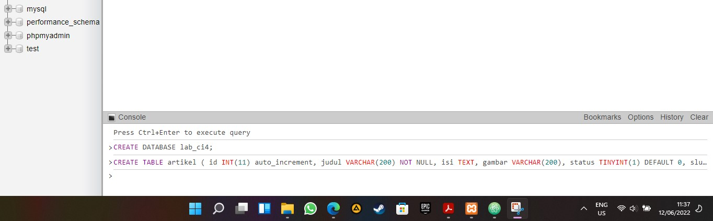
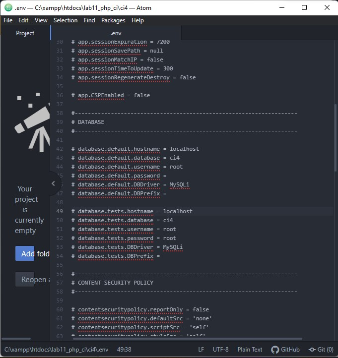
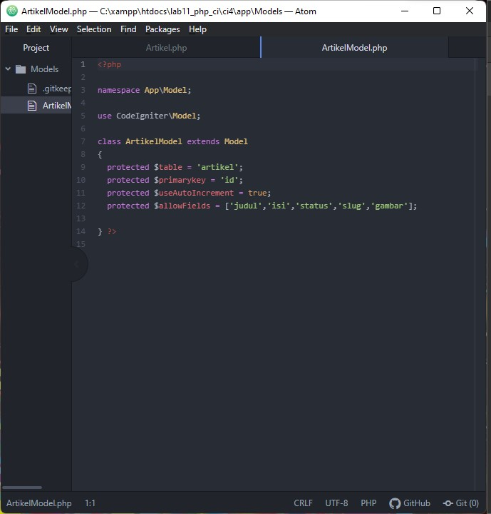
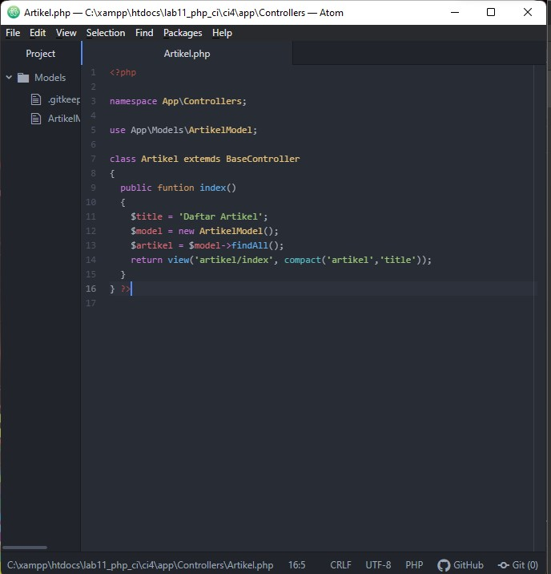
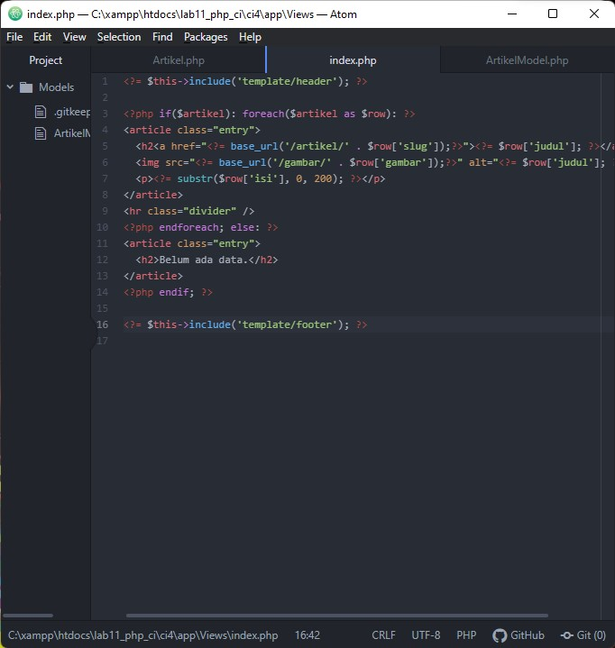

# lab12_web
bagus tri handono 
312010170 
20.TI.B1 
Praktikum 12: Framework Lanjutan (CRUD) 
__________________________________________________________________________________

1.pertama buka XAMPP control panel dan akses mysql admin lalu buat database seperti gambar dibawah ini 
 
2.lalu setting file .env pada folder codeigniter(kita gunakan lab 11 dari pertemuan kemarin) 
 
3.Selanjutnya adalah membuat Model untuk memproses data Artikel. Buat file baru pada direktori app/Models dengan nama ArtikelModel.php 
 
4.Buat Controller baru dengan nama Artikel.php pada direktori app/Controllers. 
 
5.Buat direktori baru dengan nama artikel pada direktori app/views, kemudian buat file baru dengan nama index.php. 
 